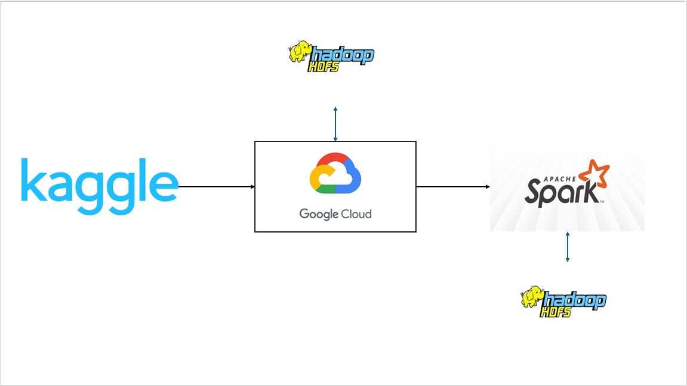

# Brazilian E-Commerce Dataset by Olist - Using GCP DataProc
## Table of Contents

- [Description](#description)
- [Architecture](#architecture)
- [Code-Flow](#code-flow)
- [Module-Explanation](#module-explanation)
- [Future-Development](#future-development)

## Description
This project demonstrates the exploration of a real world E-Commerce dataset using DataProc Cluster in Google Cloud Platform (GCP). This module demonstrated the step by step process of exploiting real world dataset.
This prohect modules consists of Data Ingestion & Exploration, Data Cleaning & Transformation, Data Integration & aggregation, Performance Optimization & Data Serving Layer.

## Architecture

1. **E-Commerce Dataset by OLIST**: Source of the data.
2. **GCP Data Proc Cluster**: To deploy spark cluster.
3. **HDFS**: HDFS File system to store the data instead of local storage.
4. **Pyspark**: Pyspark to interact with the data.

## Code-Flow

The modules is designed to:

1. Extract data from E-Commerce Dataset by Olist.
2. Store the raw data into HDFS in GCP.
3. Create data proc cluster for spark.
4. Data Cleaning, Transformation, Aggregation using pyspark in dataproc cluster.
5. Perform spark optimization for efficiency.
6. Save the transformed data back in parquet format.

## Module Explanation
- `data_ingestion_and_exploration.ipynb`:
    
    ### Setting Up the Spark Environment
    
    1.  **Deploy a Spark Cluster** (like AWS EMR, GCP Dataproc, or an on-prem Hadoop cluster, Azure HD Insight). Here we make use of GCP Data Proc Cluster.
    
    2.  **Store Data in HDFS** instead of local storage.
    
    *   Load data from Kaggle i.e. Data Source (#!/bin/bash curl -L -o ~/olist/brazilian-ecommerce.zip\\ https://www.kaggle.com/api/v1/datasets/download/olistbr/brazilian-ecommerce)
    *     !unzip brazilian-ecommerce.zip -d ~/olist/data/
    
    3.  **Use PySpark** to interact with data.

- `data_cleaning_and_transformation.ipynb`:
  
    ### Data Cleaning and Transformation

    1) Identify Issues like missing values, duplicate values, invalid dates.
    2) Handle Missing value with Drop or Fill null values.
    3) Standardize Formats like convert date time, normalize categorical fields.
    4) Date type correction with correct date type is present for each column.
    5) Deduplication, removing all duplciate records.
    6) Data Transformation.
    7) Store the cleaned/transformed data.
      
- `data_integration_and_aggregation.ipynb`:
  
    ### Data Integration and Aggregation
    1) Join Datasets efficiently.
    2) Optimization of joins.
    3) Perform Aggregations.
    4) Caching & Optimising queries for performance.
    
- `spark_property_optimization.ipynb`:
  
    ### Spark Configuration Optimization
    ### **Key Considerations for Dataproc Cluster**

    1.  **Cluster Resources:**
    
        -   **Master:** `n2-standard-4` (4 vCPUs, 16 GB RAM, 32GB disk)
        -   **Workers (2x):** `n2-standard-4` (4 vCPUs, 16 GB RAM, 64GB disk each)
        -   **Total:** 8 worker vCPUs, ~32 GB RAM (excluding master node)
    
    2.  **Dataproc Features Disabled:**
    
        -   No **autoscaling**, **Metastore**, **advanced execution layer**, **advanced optimizations**
        -   **Storage:** `pd-balanced` (no SSDs, so I/O optimization is crucial)
        -   **Networking:** Internal IP **enabled**
        
    3.  **Optimization Strategy:**
    
        -   Tune **shuffle partitions**, **broadcast join threshold**, and **storage persistence**
        -   Adjust **parallelism** based on **2 workers x 4 cores**
        -   Avoid **excessive caching** due to **disk-based storage**
    
- `data_serving.ipynb`:
  
    ### Data Serving:
    1) Save and retrieve processed data efficiently inside Dataproc.
    2) Serve data in a structured way for analysis.
    3) Use Parquet, Hive, and CSV.
    

## Future-Development
1) To solve live streaming dataset and process with GCP Data Proc Clusters.
2) To optimize more on spark configuration.
3) To solve end to end data problem with GCP.

